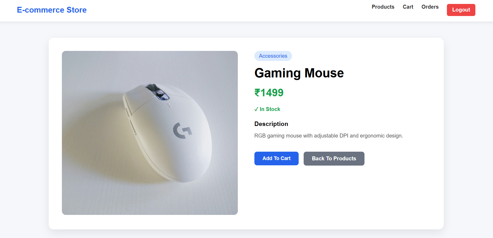
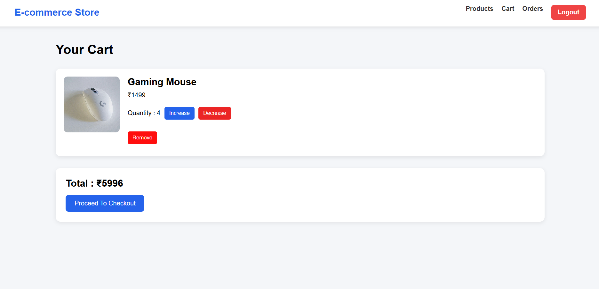
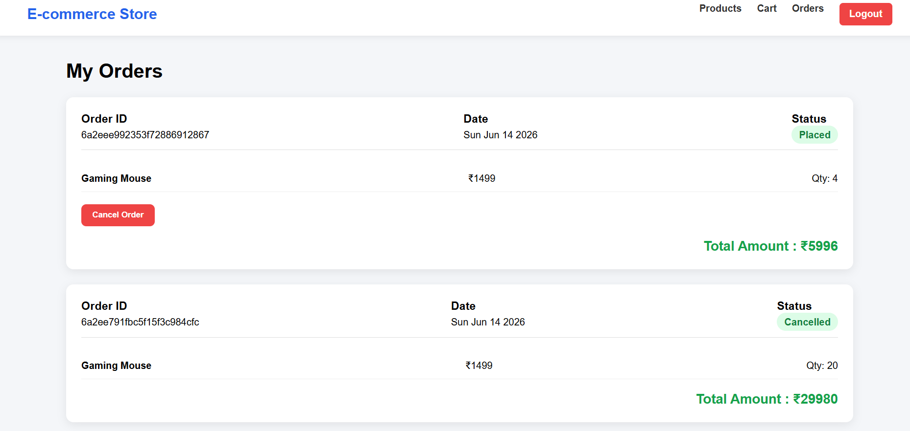

# 🛒 E-Commerce Store

A full-stack E-Commerce Store built using **Node.js, Express.js, MongoDB, EJS, HTML, CSS, and JavaScript** following the **MVC (Model-View-Controller)** architecture. The application allows users to browse products, manage their shopping cart, place orders, and track order history through a clean and user-friendly interface.

---

## 🚀 Features

### 👤 User Authentication

* User Registration
* User Login
* User Logout
* Password Encryption using Bcrypt

### 📦 Product Management

* View all available products
* Product Details Page
* Product Categories
* Stock Availability Display

### 🛒 Shopping Cart

* Add Products to Cart
* Increase Product Quantity
* Decrease Product Quantity
* Remove Products from Cart
* Automatic Total Price Calculation
* Stock Validation Before Increasing Quantity

### 📋 Order Management

* Checkout Functionality
* Create Orders
* Order History
* View Previous Orders
* Cancel Orders
* Order Status Tracking

### 💾 Database Integration

* MongoDB Database
* Mongoose ODM
* Persistent Data Storage

### 🎨 Responsive User Interface

* Modern UI Design
* Separate CSS and JavaScript Files
* User-Friendly Navigation
* Mobile Responsive Layout

---

## 🏗️ Project Architecture

The project follows the **MVC (Model-View-Controller)** architecture.

```text
E-Commerce Store
│
├── Models
│   ├── User
│   ├── Product
│   ├── Cart
│   └── Order
│
├── Views
│   ├── Login
│   ├── Register
│   ├── Products
│   ├── Product Details
│   ├── Cart
│   └── Orders
│
├── Controllers
│   ├── Authentication Controller
│   ├── Product Controller
│   ├── Cart Controller
│   └── Order Controller
│
└── Routes
    ├── Auth Routes
    ├── Product Routes
    ├── Cart Routes
    └── Order Routes
```

---

## 🛠️ Technologies Used

### Frontend

* HTML5
* CSS3
* JavaScript
* EJS

### Backend

* Node.js
* Express.js

### Database

* MongoDB
* Mongoose

### Authentication & Security

* Express Session
* Bcrypt.js

---

## 📂 Database Collections

### Users Collection

```js
{
  name,
  email,
  password
}
```

### Products Collection

```js
{
  name,
  price,
  description,
  image,
  category,
  stock
}
```

### Cart Collection

```js
{
  userId,
  items: [
    {
      productId,
      quantity
    }
  ]
}
```

### Orders Collection

```js
{
  userId,
  items,
  totalAmount,
  status,
  createdAt
}
```

---

## 🔄 Application Workflow

```text
User Registration/Login
          ↓
      Products Page
          ↓
   Product Details Page
          ↓
      Add To Cart
          ↓
       View Cart
          ↓
 Increase / Decrease Quantity
          ↓
       Checkout
          ↓
      Create Order
          ↓
      Order History
          ↓
      Cancel Order
```

---

## ⚙️ Installation

### Clone Repository

```bash
git clone https://github.com/Bhavya0706/CodeAlpha_e-commerce-store.git
```

### Move Into Project Directory

```bash
cd Simple E-commerce Store
```

### Install Dependencies

```bash
npm install
```

### Create Environment File

Create a `.env` file in the root directory:

```env
MONGO_URL=your_mongodb_connection_string
```

### Run Application

```bash
npm start
```

Server will start on:

```text
http://localhost:3000
```

---

## 📸 Screenshots

### 🛍️ Products Page


### 📦 Product Details Page



### 🛒 Cart Page



### 📋 Orders Page



---

## 🎯 Learning Outcomes

Through this project, I gained practical experience in:

* MVC Architecture
* Express.js Routing
* MongoDB CRUD Operations
* Session Management
* User Authentication
* EJS Templating
* Shopping Cart Logic
* Order Processing Workflow
* Full Stack Web Development

---

## 👨‍💻 Author

**Bhavya Suthar**

B.Tech Information Technology
LD College of Engineering


